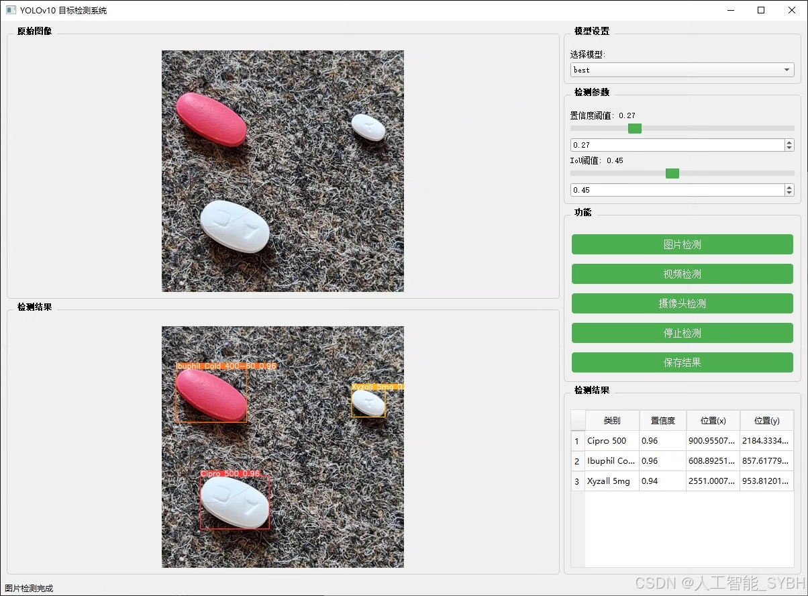
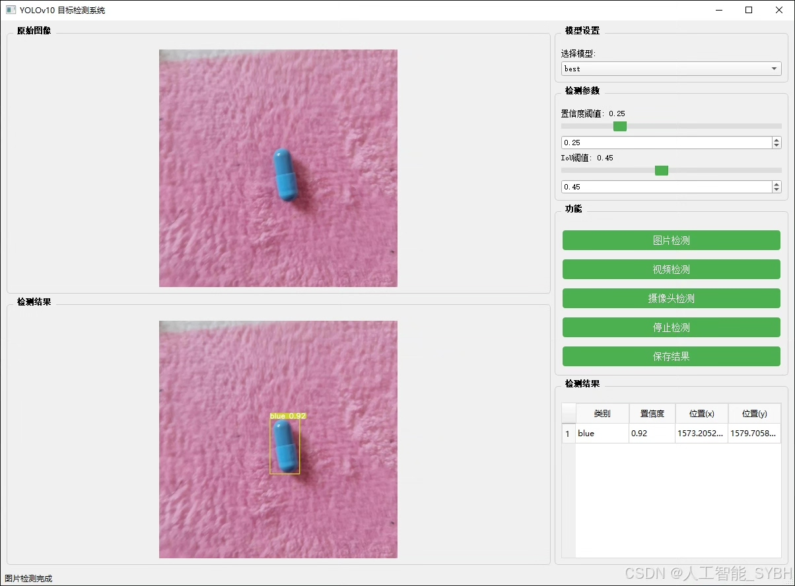
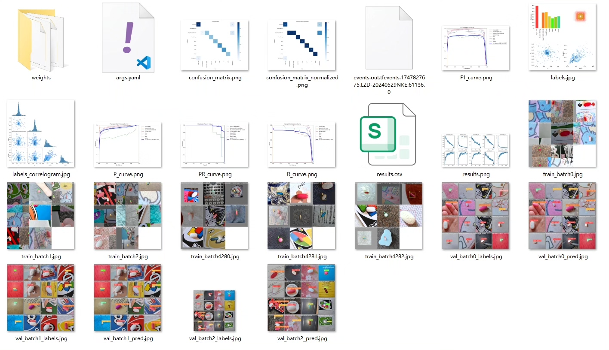
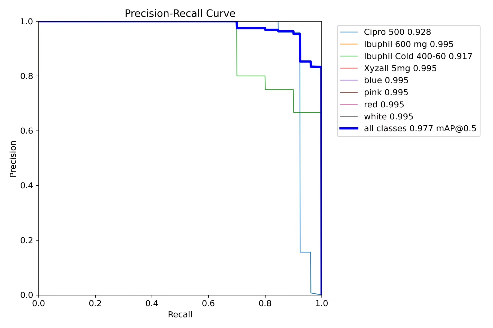
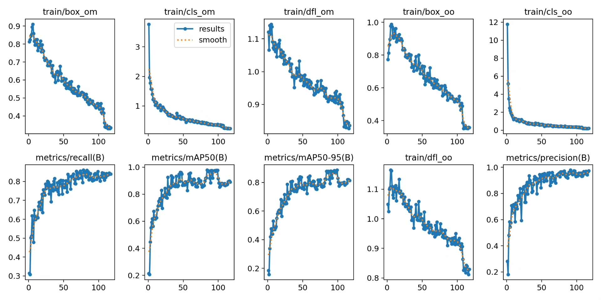
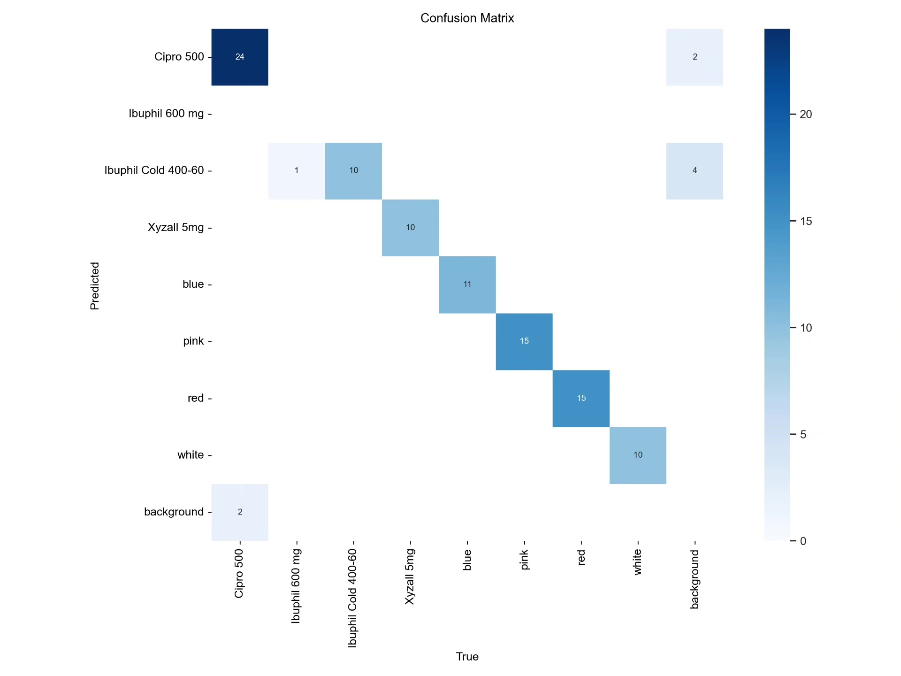
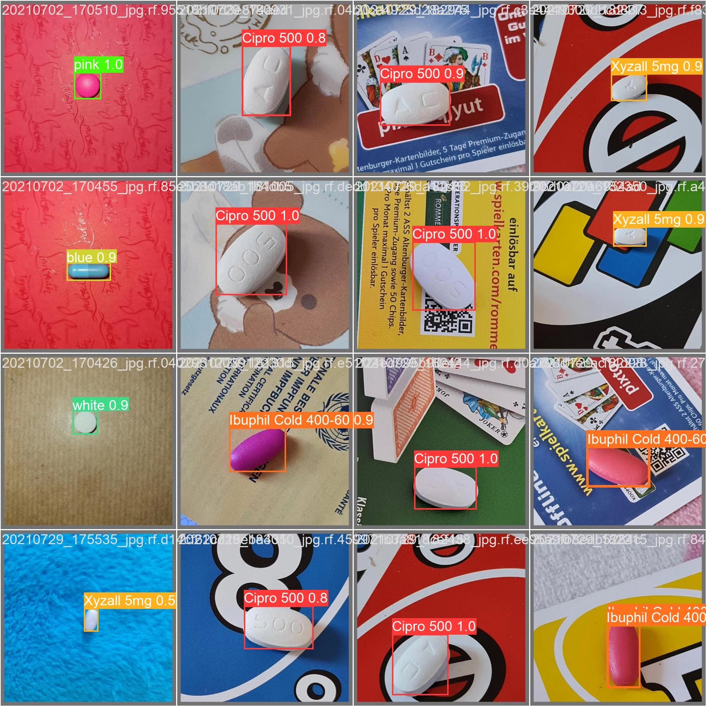
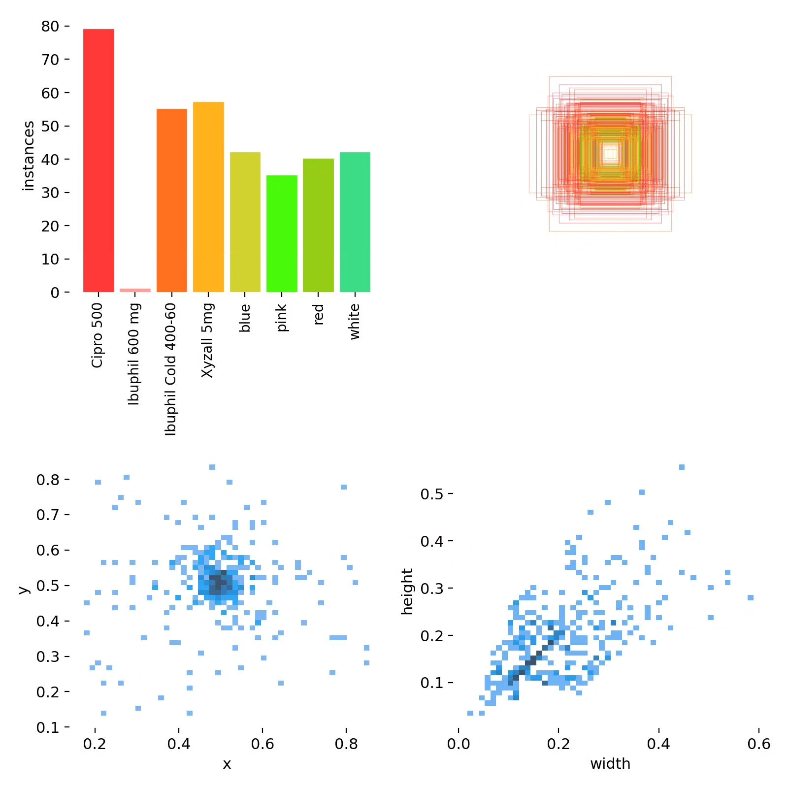

# YOLOv10-based drug recognition detection system based on deep learning

## Body

Based on the cutting-edge YOLOv10 object detection algorithm, this project has developed a high-precision drug recognition and classification system. It is specifically designed for drug identification and classification. The system can accurately recognize eight specific drugs (including five specific drugs and three color categories): Cipro 500, Ibuprofen 600 mg, Ibuprofen Cold 400-60, Xyzall 5mg, as well as blue, pink, red, white pills. The project uses a professional dataset of drug images for training and evaluation. Through network optimization and training strategy adjustments targeting drug features, this system has achieved high-precision recognition of the appearance of drugs, providing innovative technical solutions for scenarios such as pharmaceutical management, intelligent pharmacies, and patient medication safety.

The company's products have obtained YOLO official commercial license certification.

We provide after-sales service.

After payment, we will provide WeChat ID to answer questions anytime.

Environmental configuration: We will provide an instruction tutorial for setting up the environment, and WeChat will provide answers.

Remote installation service: If you need remote configuration, an additional fee of 69 is required, with all fees refunded if the configuration fails (only the installation fee is refunded for older computers).

Retraining dataset: After setting up the environment, you can train on your own computer. If you need us to retrain, just pay 69 plus computing power fees (2.5 yuan/hour).

Full after-sales service

## Images

## Payment

Here is a pay link on Stripe ( https://buy.stripe.com/3cs8yP7sY87d0vu9AB ). Please contact me lonlonago@foxmail.com after funding $89, and I will send you a complete data files , thank you!

